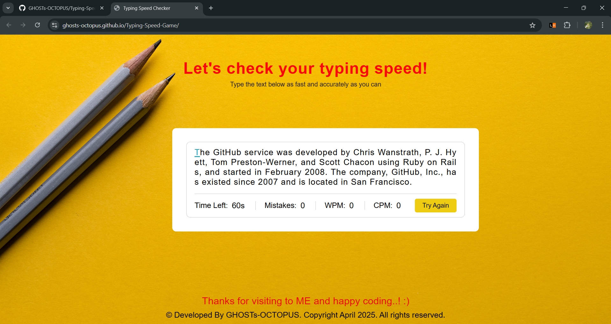

# Typing Speed Game

## Description
Typing Speed Game is a web application which allow's users to test their typing speed by typing various texts as fast as they can. During the game, users can see typing metrics such as number of mistakes, WPM (words per minute), and CPM (characters per minute).

## Technologies used

- HTML
- CSS
- JavaScript

## Features

- A time limit in which the user has to type the displayed paragraph
- Tracks number of mistakes in the user's typed text
- Real time WPM (words per minute) tracker
- Real time CPM (characters per minute) tracker
- Option to try again with new text

## Screenshots



## Getting Started

### Installation

To run Typing Speed Game locally:

1. Clone the repository:

 ```bash
 git clone https://github.com/GHOSTs-OCTOPUS/Typing-Speed-Game.git
 ```

 2. Navigate to the project directory:

 ```bash
 cd Projects
 cd "Typing Speed Game"
 ```

 3. Open the **index.html** file in any web browser of your choice. 

 4. Begin typing the text that appears to test your typing speed!

 ### Usage

 1. Begin typing the displayed text as it appears. The timer will begin once you start typing.

 2. If you make a mistake, use the backspace button to undo it or continue typing.

 3. Try to finish typing the text before time runs out.

 4. Click the "Try Again" button to play again with a different text!

